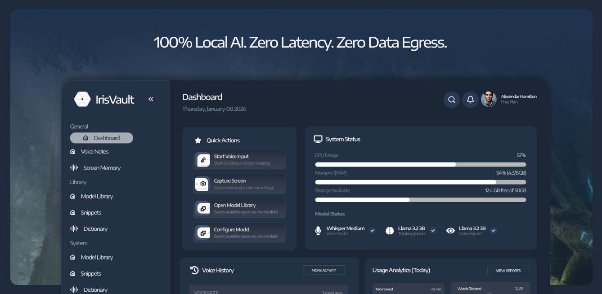

<div align="center">

# 

### Privacy-First Desktop Application for Local AI-Powered Screen Capture

[](https://tauri.app)
[](https://www.rust-lang.org)
[](LICENSE)

[](https://github.com/Iris-Vault)
[](https://github.com/Iris-Vault)
[](https://github.com/Iris-Vault)

</div>

---

## 🎯 What We're Building

A **Tauri desktop application** that provides AI-powered screen analysis while keeping all data completely local.

```
┌─────────────────────────────────────────────────┐
│  🖥️  Screen Capture  →  🤖 AI Analysis         │
│                                                 │
│  ✓ 100% Local Processing                       │
│  ✓ Zero Data Transmission                      │
│  ✓ Privacy-First Architecture                  │
└─────────────────────────────────────────────────┘
```

## ✨ Key Features

<table>
<tr>
<td width="50%">

**🔒 Privacy-First**
- All processing on-device
- No cloud dependencies
- No data transmission

</td>
<td width="50%">

**⚡ Performance**
- Native desktop speed
- Rust-powered backend
- Efficient AI inference

</td>
</tr>
<tr>
<td width="50%">

**🌍 Cross-Platform**
- Windows support
- macOS support
- Linux support

</td>
<td width="50%">

**🤖 AI-Powered**
- Local ML models
- Smart capture analysis
- Offline functionality

</td>
</tr>
</table>

## 🛠️ Technology Stack

| Category | Technologies |
|----------|-------------|
| **Framework** | Tauri 2.0 |
| **Backend** | Rust |
| **Frontend** | Web Technologies |
| **AI/ML** | Local models, on-device inference |
| **Platforms** | Windows, macOS, Linux |

## 📦 Projects

### Featured Repository
> Coming soon - Watch this space for our main application repository

## 🤝 Contributing

We welcome contributions from developers interested in privacy-focused desktop applications!

**Ways to Contribute:**
- Report bugs and suggest features
- Submit pull requests
- Improve documentation
- Share feedback and ideas

## 📫 Community

<div align="center">

[](https://github.com/Iris-Vault)
[](https://github.com/orgs/Iris-Vault/discussions)

</div>

---

<div align="center">

**License:** MIT | **© 2026 Iris Vault**

*Your screen. Your data. Your device.*

</div>
